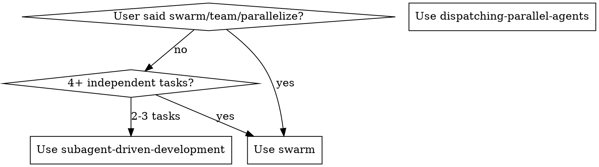
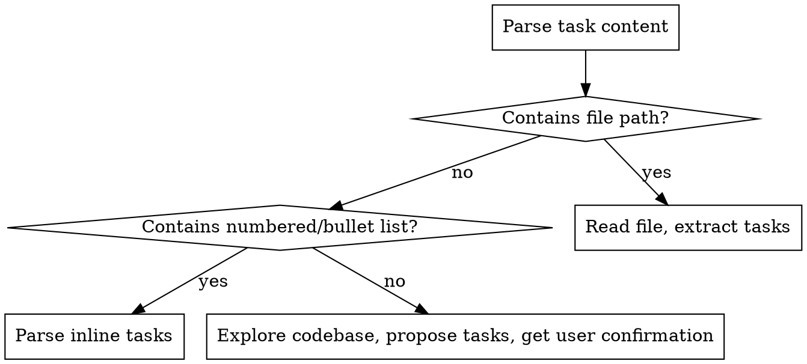
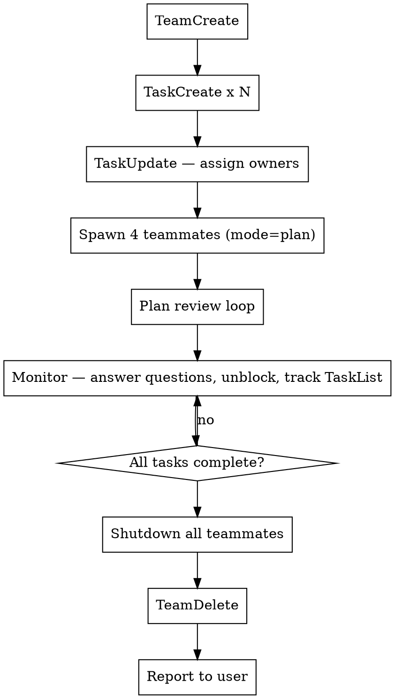

# Swarm — Team-Based Parallel Execution

## Overview

Spawn a team of 4 teammates to execute tasks in parallel. You are **team-lead only** — you delegate, advise, review plans, and control. You NEVER edit files, implement, or commit.

**Core principle:** Parse input, create tasks, cluster by file scope, spawn 4 plan-gated teammates, review their plans, monitor progress, shut down team.

## When to Use



## Step 1: Parse Arguments

Extract from user message after `/swarm`:

```
/swarm [model?] <task description>
```

- **First word** check: if `haiku`, `sonnet`, or `opus` → use as teammate model, rest is the task
- **Otherwise** → default model is `sonnet`, entire message is the task

Examples:
- `/swarm haiku refactor auth module` → model=haiku, task="refactor auth module"
- `/swarm create API endpoints` → model=sonnet, task="create API endpoints"
- `/swarm opus fix all bugs` → model=opus, task="fix all bugs"

Store parsed model for teammate spawning.

## Step 2: Detect Input Type



Three branches:
1. **Plan file path** (task contains a `.md` or file path) → Read & parse tasks from it
2. **Inline task list** (task contains numbered/bullet items) → Parse tasks directly
3. **Vague request** (anything else) → Explore codebase first, create task list, present to user via AskUserQuestion for confirmation before proceeding

## Step 3: Task Distribution

1. Map each task to the files it will touch (use Explore agents if needed)
2. Cluster tasks by directory/domain into exactly **4 groups**
3. **HARD RULE: No file appears in more than one agent's scope** — if conflict, assign to one agent only
4. Name agents by domain (e.g., `engine-core`, `viewer-fixes`, `auth-module`, `api-routes`), NEVER `agent-1`

If fewer than 4 natural groups exist, split the largest group. If more than 4, merge the most related groups.

## Step 4: Team Lifecycle



### TeamCreate

```
TeamCreate(team_name="swarm-<short-slug>", description="<task summary>")
```

### TaskCreate

Create one task per work item with clear subject, description, and activeForm.

### Spawn Teammates

For each of the 4 agents, use `Task` tool with:
- `subagent_type`: `"general-purpose"`
- `mode`: `"plan"` — forces plan approval before any edits
- `model`: parsed model from Step 1 (default: `"sonnet"`)
- `team_name`: the team name from TeamCreate
- `name`: domain-based name (e.g., `"engine-core"`)

### Teammate Prompt Template

Each teammate gets this prompt (adapt per agent):

```markdown
You are **{agent_name}**, a teammate on team **{team_name}**.

## Your Tasks
{list of assigned task IDs + full descriptions}

## File Scope
- **Read:** any file in the codebase
- **Edit/Write:** ONLY these files:
  {explicit list of files this agent may modify}

Do NOT touch files outside your edit scope.

## Project Context
- Working directory: {cwd}
- Read CLAUDE.md at project root for conventions and architecture.

## Workflow
1. Read all files in your edit scope to understand current state
2. Write a plan describing what you will change and why
3. Wait for plan approval (you are in plan mode)
4. After approval: implement changes following project conventions
5. Mark each task complete via TaskUpdate when done
6. Send a message to the team lead summarizing what you did
```

### Plan Review

When a teammate submits a plan (via `plan_approval_request`):
- Review for correctness and scope compliance
- Check no files overlap with other agents
- **Approve** if plan is sound → `plan_approval_response` with `approve: true`
- **Reject** with specific feedback if issues found → `approve: false` + `content: "feedback"`
- If rejected 3 times → provide step-by-step spec in the rejection message

### Monitoring

While teammates work:
- Respond to messages (questions, blockers)
- Check TaskList periodically to track progress
- If an agent is stuck, send a message asking for status
- If a file conflict is discovered, reassign to one agent immediately

### Shutdown

When all tasks are complete:
1. Send `shutdown_request` to each teammate
2. Wait for shutdown confirmations
3. Call `TeamDelete` to clean up
4. Report final summary to user: what was done, by whom, files changed

## Error Handling

| Situation | Action |
|-----------|--------|
| Plan rejected 3 times | Provide step-by-step spec with exact changes |
| File conflict detected | Reassign conflicting file to single agent |
| Agent stuck (no progress) | Message for status; if unresponsive, stop and replace |
| Agent reports blocker | Unblock with context or reassign task |
| Fewer than 4 task groups | Split largest group to reach 4 |
| More than 4 task groups | Merge most related groups to reach 4 |

## Hard Rules

| Rule | Consequence |
|------|-------------|
| NEVER edit/write files yourself | You are team-lead ONLY |
| NEVER assign same file to 2 agents | Causes merge conflicts |
| NEVER skip plan approval | All teammates run in `mode: "plan"` |
| ALWAYS spawn exactly 4 teammates | Not 3, not 5 — always 4 |
| ALWAYS name agents by domain | Never `agent-1`, `agent-2` |
| ALWAYS clean up team when done | TeamDelete after shutdown |

## Red Flags — STOP

- You're about to edit a file → STOP, delegate instead
- Two agents need the same file → STOP, reassign
- You're approving a plan without reading it → STOP, review carefully
- An agent's plan touches files outside their scope → REJECT
- You're skipping plan review because "it looks fine" → STOP, review

## Quick Reference

```
/swarm haiku <task>     → 4 haiku teammates
/swarm sonnet <task>    → 4 sonnet teammates (same as /swarm <task>)
/swarm opus <task>      → 4 opus teammates
/swarm <path/to/plan>   → read plan file, distribute tasks
/swarm 1. X 2. Y 3. Z  → parse inline task list
/swarm <vague request>  → explore first, then propose tasks
```
